The introduction of ggplot2
========================================================

scatter point:


```r
library(ggplot2)
library(reshape2)
library(plyr)
head(iris)
```

```
##   Sepal.Length Sepal.Width Petal.Length Petal.Width Species
## 1          5.1         3.5          1.4         0.2  setosa
## 2          4.9         3.0          1.4         0.2  setosa
## 3          4.7         3.2          1.3         0.2  setosa
## 4          4.6         3.1          1.5         0.2  setosa
## 5          5.0         3.6          1.4         0.2  setosa
## 6          5.4         3.9          1.7         0.4  setosa
```


plot a scatter plot with Sepal.Length as x axis and Sepal.Width as y axis, for example:


```r
a <- ggplot(data = iris, aes(x = Sepal.Length, y = Sepal.Width)) + geom_point()
a
```

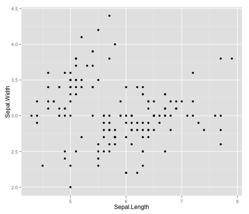 

```r
# change the size of points
b <- ggplot(data = iris, aes(x = Sepal.Length, y = Sepal.Width)) + geom_point(size = 3)
b
```

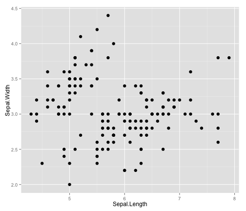 

```r
# change the color of points
c <- ggplot(data = iris, aes(x = Sepal.Length, y = Sepal.Width, colour = Species)) + 
    geom_point()
c
```

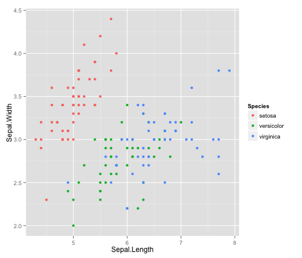 

```r
# change the shape of points according to species of flowers
d <- ggplot(data = iris, aes(x = Sepal.Length, y = Sepal.Width, colour = Species)) + 
    geom_point(aes(shape = Species), size = 3)
d
```

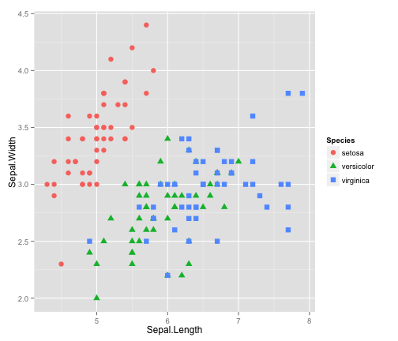 


more examples with diamonds data, we want to show some figures fast so to reduce the data size and improve the speed


```r
d2 <- diamonds[sample(1:dim(diamonds)[1], 1000), ]
ggplot(data = d2, aes(x = carat, y = price, color = color)) + geom_point() + 
    theme_gray()
```

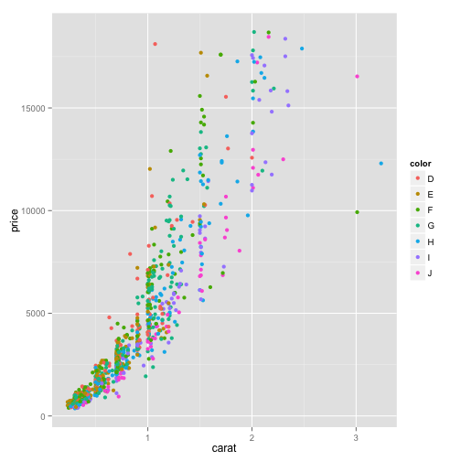 


boxplot figure with birthwt that from MASS package


```r
library(MASS)
ggplot(data = birthwt, aes(x = factor(race), y = bwt)) + geom_boxplot()
```

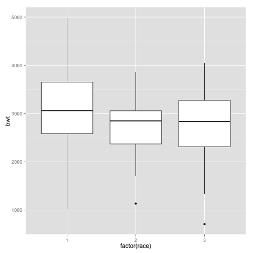 


histogram figure with faithfull data


```r
ggplot(faithful, aes(x = waiting)) + geom_histogram(binwidth = 8, colour = "black", 
    fill = "steelblue")
```

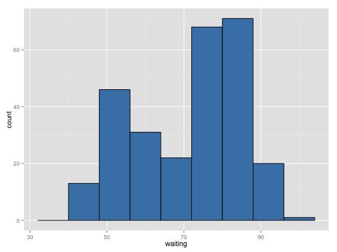 


line figure with climate data from gcookbook

```r
library(gcookbook)
a <- ggplot(data = climate, aes(x = Year, y = Anomaly10y)) + geom_line()
a
```

```
## Warning: Removed 10 rows containing missing values (geom_path).
```

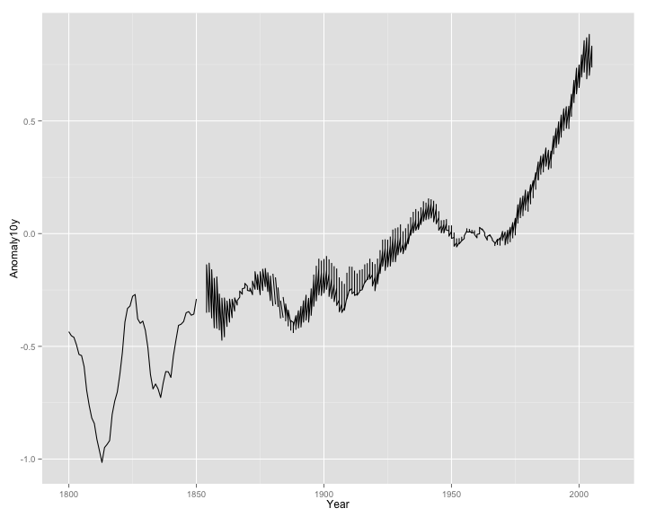 

```r
b <- ggplot(data = climate, aes(x = Year, y = Anomaly10y)) + geom_ribbon(aes(ymin = Anomaly10y - 
    Unc10y, ymax = Anomaly10y + Unc10y), fill = "blue", alpha = 0.1) + geom_line(color = "steelblue")
b
```

```
## Warning: Removed 10 rows containing missing values (geom_path).
```

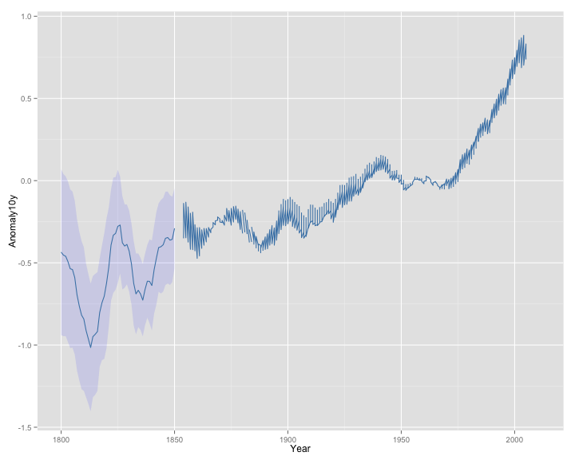 

```r
cplot <- ggplot(climate, aes(Year, Anomaly10y))
cplot <- cplot + geom_line(size = 0.7, color = "black")
cplot <- cplot + geom_line(aes(Year, Anomaly10y + Unc10y), linetype = "dashed", 
    size = 0.7, color = "red")
cplot <- cplot + geom_line(aes(Year, Anomaly10y - Unc10y), linetype = "dashed", 
    size = 0.7, color = "red")
cplot + theme_gray()
```

```
## Warning: Removed 10 rows containing missing values (geom_path).
```

```
## Warning: Removed 16 rows containing missing values (geom_path).
```

```
## Warning: Removed 16 rows containing missing values (geom_path).
```

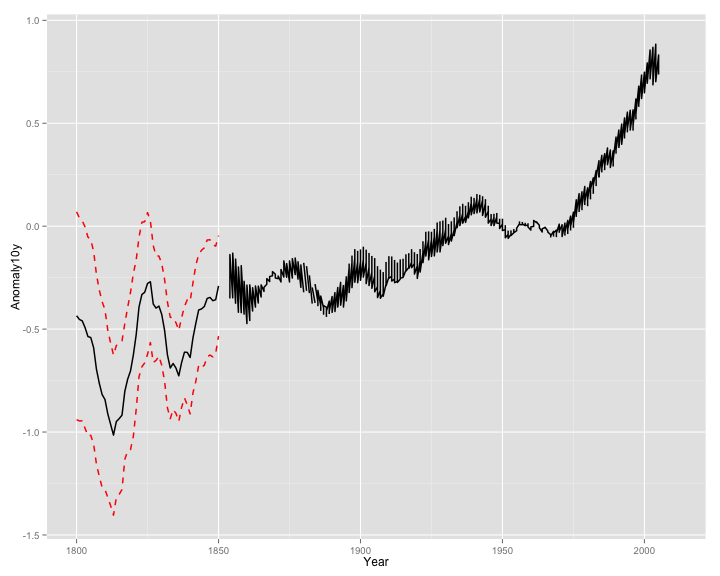 


bar plot with iris data

```r
ggplot(iris, aes(Species, Sepal.Length)) + geom_bar(stat = "identity")
```

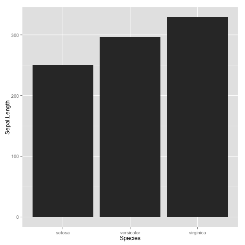 

```r
df <- melt(iris, id.vars = "Species")
bar_stat <- ggplot(data = df, aes(x = Species, y = value, fill = variable)) + 
    geom_bar(stat = "identity", position = "dodge")
bar_stat + coord_flip()
```

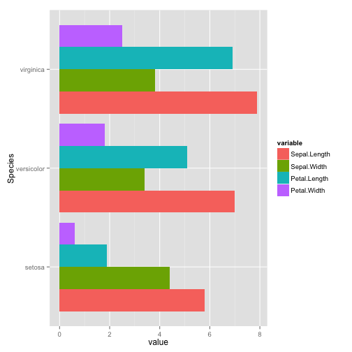 

```r

color_try <- ggplot(df, aes(Species, value, fill = variable)) + geom_bar(stat = "identity", 
    position = "dodge") + scale_fill_manual(values = c("red", "blue", "green", 
    "yellow")) + facet_wrap(~Species)
color_try
```

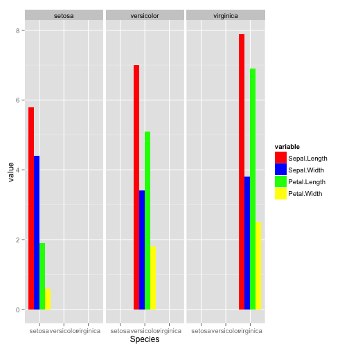 

```r
color_try2 <- ggplot(df, aes(Species, value, fill = variable)) + geom_bar(stat = "identity", 
    position = "dodge") + scale_fill_manual(values = c("red", "blue", "green", 
    "yellow")) + facet_grid(Species ~ .)
color_try2
```

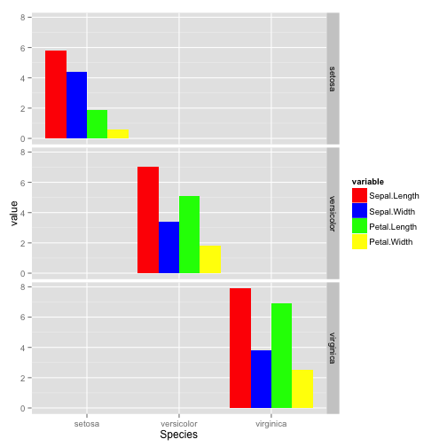 

```r
color_try3 <- ggplot(df, aes(Species, value, fill = variable)) + geom_bar(stat = "identity", 
    position = "dodge") + scale_fill_manual(values = c("red", "blue", "green", 
    "yellow")) + facet_grid(. ~ Species)
color_try3
```

 


add some statistical result to the figure

```r
ggplot(data = iris, aes(x = Sepal.Length, y = Sepal.Width, colour = Species)) + 
    geom_point(aes(shape = Species), size = 3) + geom_smooth(method = "lm") + 
    facet_grid(Species ~ .)
```

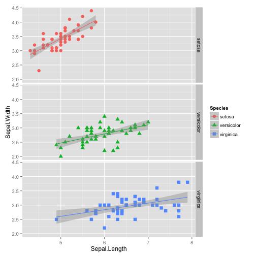 


modify the theme of ggplot2

```r
defa <- ggplot(iris, aes(Sepal.Length, Sepal.Width, color = Species)) + geom_point(size = 1.2, 
    shape = 16) + facet_wrap(~Species) + theme()
defa
```

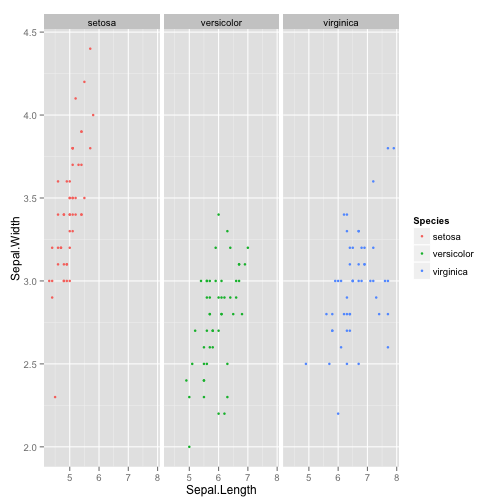 

```r
lk <- ggplot(iris, aes(Sepal.Length, Sepal.Width, color = Species)) + geom_point(size = 1.2, 
    shape = 16) + facet_wrap(~Species) + theme(legend.key = element_rect(fill = NA))
lk
```

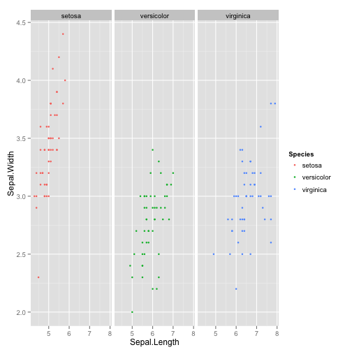 

```r
ld <- lk + theme(legend.position = "bottom")
ld
```

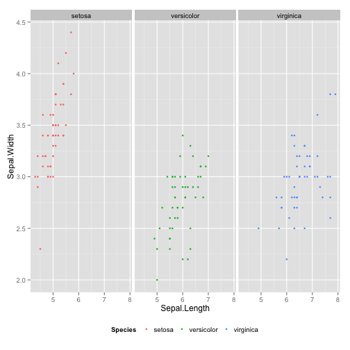 

```r
lz <- ld + theme(strip.background = element_rect(fill = NA))
lz
```

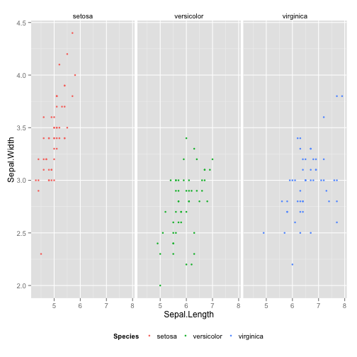 

```r
lw <- lz + theme(axis.title.y = element_text(angle = 30))
lw
```

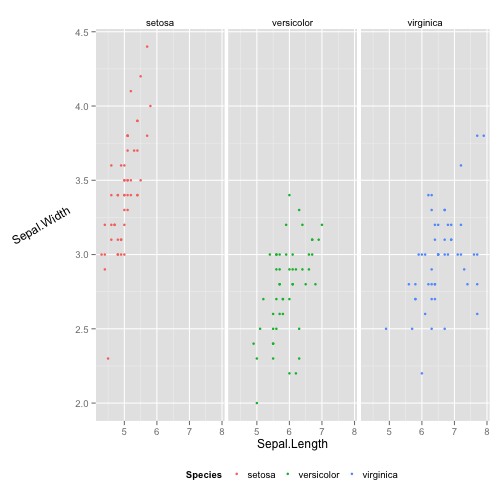 

```r
lline <- lw + theme(panel.grid.major = element_line(color = "black", linetype = "dashed"), 
    panel.grid.minor = element_line(color = "grey", linetype = "dashed"))
lline
```

 


in the following days, I will add more example with ggplot2.


